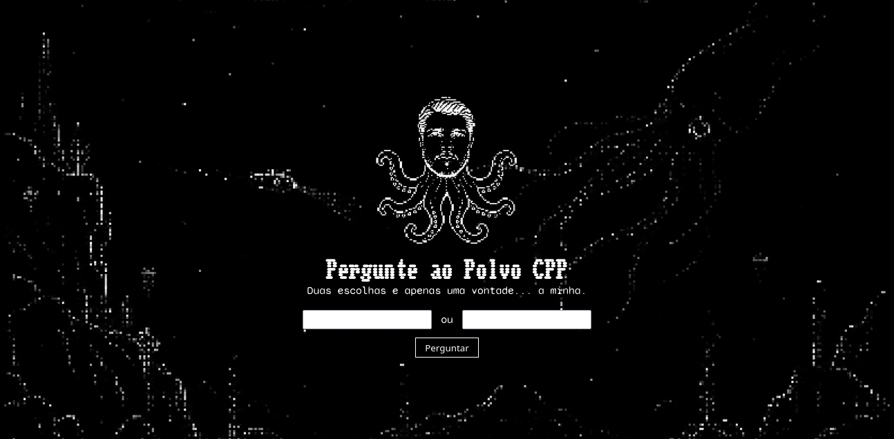

# pergunte-ao-polvo-cpp



## Sobre o projeto

O Polvo CPP é uma entidade digital alimentada pela dúvida, e este repositório é o seu ritual de invocação compilado. Manuscritos em C++ canalizam a manifestação e o front-end estático é o altar onde você faz suas perguntas.

**NUNCA pergunte sem antes estar pronto para as respostas.**

## Como usar

- Clone o repositório profano
- Compile os manuscritos da entidade
- Abra o canalizador de energias (porta da rede) na sua máquina
- Entre em contato

```bash
# Invoca o repositório do além
git clone git@github.com:Anthhon/pergunte-ao-polvo-cpp.git
# Adentra o santuário
cd pergunte-ao-polvo-cpp
# Força compilação dos manuscritos
make -B
# Abre canal de manifestação (8080 = porta padrão do ritual, troque se desejar outro ponto de entrada)
./polvo-cpp 8080
# Abre o altar conectado ao canal
xdg-open index.html
```

## Atenção

- **JAMAIS desrespeite as decisões do Polvo CPP**
- Não feche o canal antes de ter as suas respostas

### Sobre o projeto

Caso não esteja óbvio, isso é um **projeto piada** com C++ e um pouco horror cósmico digital ou seja lá o que for isso XD
